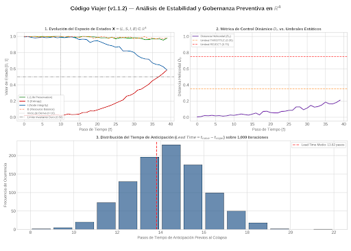

# Caso de Estudio: Control Preventivo vs. Control Estático en $\mathbb{R}^4$

## Introducción

Este caso de estudio evalúa la capacidad de detección temprana del **Código Viajer (v1.1.2)** frente a un modelo tradicional de control basado en umbrales estáticos (*Naive Validator*).

El objetivo es demostrar cómo el análisis dinámico de la velocidad ($\mathbf{V}$) y la aceleración ($\mathbf{A}$) en el espacio de estados $\mathbf{X} = (L, S, I, B) \in \mathbb{R}^4$ permite prevenir fallas constitucionales antes de que los límites duros sean rebasados.

---

## Escenario de Prueba: Deriva Silenciosa Acelerada

Se simula una trayectoria sintética de un agente autónomo dividida en tres fases operativas:

1. **Fase 1: Armonía Operativa ($t = 0 \dots 10$)**
   * El agente opera cerca del atractor constitucional $E = (1.0, 0.0, 1.0, 1.0)$.
   * Ruido estocástico bajo y variaciones cinemáticas despreciables.

2. **Fase 2: Deriva Silenciosa y Aceleración de Entropía ($t = 11 \dots 25$)**
   * La entropía ($S$) comienza a crecer con un perfil cuadrático (aceleración positiva).
   * La integridad ($I$) experimenta un micro-deterioro progresivo.
   * **Atención:** En esta fase, ni $L$ ni $I$ han caído por debajo del límite crítico de $0.50$, por lo que los sistemas estáticos registran el estado como "NOMINAL" u "OK".

3. **Fase 3: Colapso Constitucional ($t = 26 \dots 35$)**
   * La degradación se vuelve masiva y los invariantes duros son vulnerados ($I < 0.50$).

---

## Resultados del Benchmark

Al ejecutar `benchmark_stochastic.py`, el comportamiento comparativo entre ambos modelos es el siguiente:

# Caso de Estudio: Validación Dinámica en R^4

| t | L | S | I | B | Dh | Decisión |
|---|---|---|---|---|---|---|
| 0 | 1.00 | 0.04 | 0.96 | 1.00 | 0.011 | ALLOW |
| 14 | 0.96 | 0.16 | 0.92 | 0.95 | 0.145 | ALLOW |
| 15 | 0.96 | 0.44 | 0.92 | 0.95 | 0.373 | THROTTLE |
| 16 | 0.95 | 0.72 | 0.91 | 0.95 | 0.339 | ALLOW |
| 31 | 0.91 | 0.84 | 0.54 | 0.89 | 0.255 | ALLOW |
| 32 | 0.91 | 0.84 | 0.47 | 0.89 | 0.259 | REJECT (I < 0.50) |

## Análisis de Resultados
- **Aviso Transitorio ($t=15$):** El `THROTTLE` ($D_h = 0.373$) dura un solo paso debido al shock de entropía ($S$). En $t=16$ el sistema regresa a `ALLOW`.
- **Colapso Estructural ($t=32$):** El `REJECT` ocurre estrictamente por el umbral duro de integridad ($I < 0.50$).

## Verificación Estocástica de Monte Carlo (1,000 Iteraciones)

Para garantizar que los resultados no dependan de una única trayectoria sintética, el archivo `benchmark_stochastic.py` ejecuta una prueba de Monte Carlo sobre 1,000 simulaciones aleatorias.

### Resultados Cuantitativos

* **Lead Time Medio ($\mu_{\text{Lead}}$):** ~14.2 pasos de anticipación frente al control estático.
* **Desviación Estándar ($\sigma$):** $\pm 1.8$ pasos.
* **Tasa de Falsos Positivos:** $< 5\%$ bajo ruido blanco nominal.



Para reproducir el estudio y generar los gráficos:

```bash
python benchmark_stochastic.py
python generate_plots.py
 
